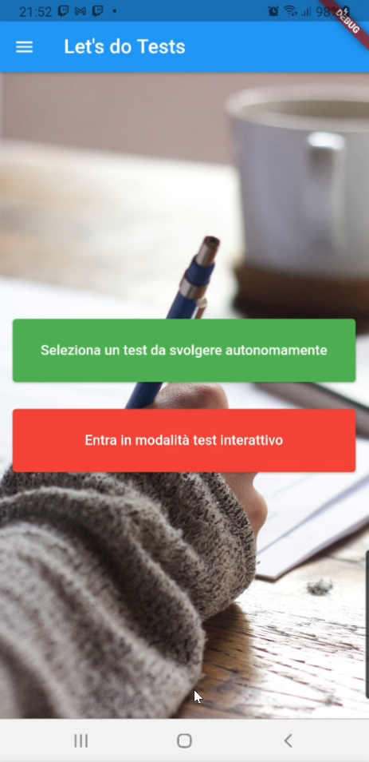
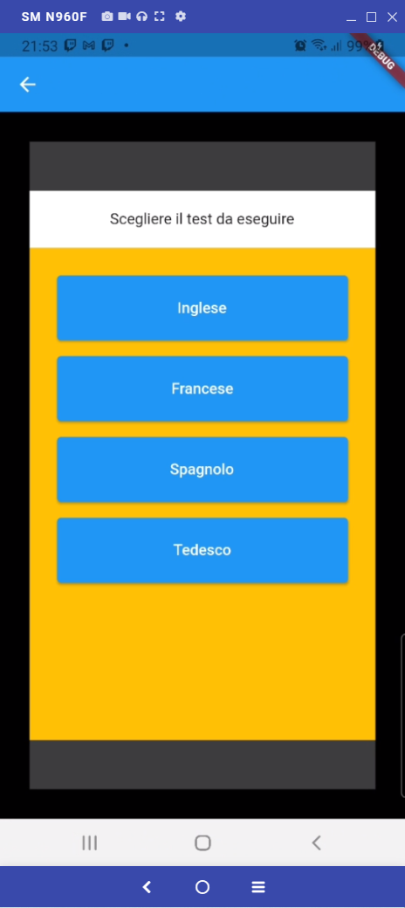
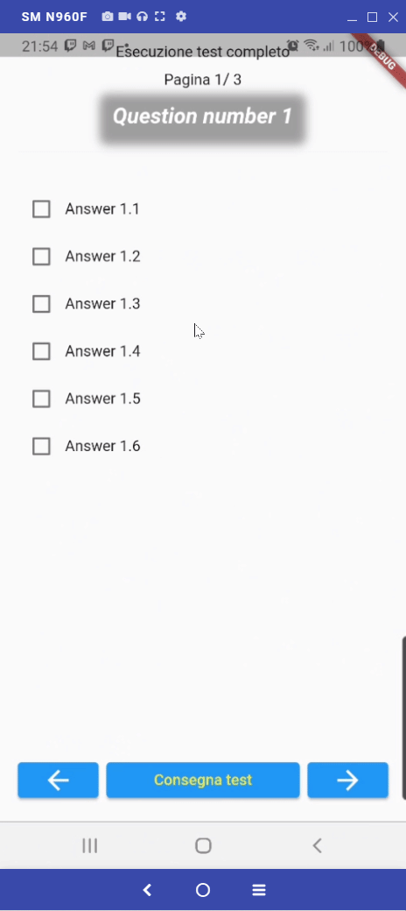

# ASPDM
[app logo](docs/img/logo_base_big.png "Logo")
Progetto di APPLICAZIONI SOFTWARE E PROGRAMMAZIONE PER DISPOSITIVI MOBILI della Laurea Magistrale in Informatica Applicata dell'Università di Urbino Carlo Bo

**Studente:** Paride Dominici 
**Matricola:** 306075

# Introduzione
Il progetto ha lo scopo di realizzare una applicazione per lo svolgimento di test generici con valutazione automatica del risultato.

# Casi d'uso
1. Valutazione autonoma delle capacità dello studente scegliendo uno dei test a disposizione
2. Verifica delle competenze degli studenti da parte degli insegnanti che sceglieranno il test da 
far fare allo studente. 

## Fasi del test
Il test si divide in diverse fasi:
1. Scelta del Test da svolgere
2. Esecuzione del test
3. Valutazione delle risposte e visualizzazione del risultato

# Fasi dello sviluppo
1. Applicazione statica con test hard coded e come unica tipologia di test quello a scelta multipla
2. Scaricamento dei dati dei test da un server remoto e caricamento dei risultati su un server remoto
3. Aggiunta di altre tipologie di test (fill in the gaps, dropdown, ecc.)

# Interfaccia utente e funzionamento
Quando si lancia il programma si viene posti di fronte alla scelta se fare uno dei test già caricati
o se mettersi in attesa che un test venga lanciato da remoto (ad esempio da un insegnante)

Cliccando sulla scelta *Seleziona un test da svolgere autonomamente* si apre una seconda pagina in
cui è possibile scegliere quale, dei test a disposizione si vuole fare.

L'elenco dei test viene caricato dinamicamente dall'esterno. Al momento il file json che contiene
l'elenco dei test è contenuto nel file [test_list.json](https://raw.githubusercontent.com/pdomi2001/aspdm/main/resources/test_list.json)

Cliccando sul test desiderato questo viene caricato e viene mostrata la prima domanda.
Ci si può muovere tra le domande scrollando a destra e sinistra e selezionare la risposta che si 
ritiene esatta cliccando sul box a fianco della risposta.

I vari test sono contenuti in diversi file .json. Quelli su cui sono state fatte le prove sono i seguenti:
[Test di Inglese](https://raw.githubusercontent.com/pdomi2001/aspdm/main/resources/inglese.json)
[Test di Francese](https://raw.githubusercontent.com/pdomi2001/aspdm/main/resources/francese.json)
[Test di Spagnolo](https://raw.githubusercontent.com/pdomi2001/aspdm/main/resources/spagnolo.json)
[Test di Tedesco](https://raw.githubusercontent.com/pdomi2001/aspdm/main/resources/tedesco.json)

Una volta terminato di esaminare le domande per conoscere il risultato sarà sufficiente cliccare sul 
pulsante in basso al centro con la scritta *Consegna Test*.
Il test verrà valutato e verrà mostrato un riepilogo dei punti ottenuti sul massimo dei punti 
ottenibili.

# Funzioni aggiuntive

#
